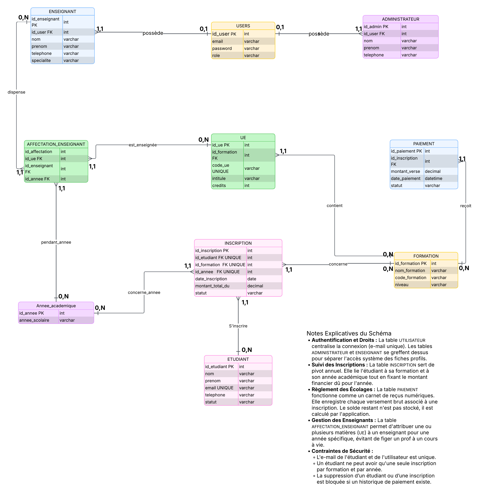

# Cahier des Charges Fonctionnel et Technique

## Projet : Intégration de la brique Dashboard de gestion administrative et académique

> [!IMPORTANT]
> Merci de respecter les tâches qui vous sont attribuées.
> Chaque fonctionnalité doit être développée dans une branche dédiée et soumise via une Pull Request distincte avant toute intégration dans la branche principale.

**Établissement :** INSEC (Centre associé CNAM INTEC)

---

## 1. Contexte et Objectifs du Projet
L'INSEC est un centre associé du CNAM INTEC. Dans le cadre de ses activités de formation, l'INSEC assure le suivi administratif et académique des étudiants inscrits aux différentes formations proposées.

L'objectif de ce projet est de mettre en place un tableau de bord centralisé permettant d'assurer le suivi des étudiants, des inscriptions, des paiements, des examens, des enseignants et des activités administratives de l'INSEC.

Ce tableau de bord doit constituer un outil de gestion et de suivi opérationnel destiné à faciliter le travail quotidien de l'administration, plutôt qu'un simple outil de pilotage ou de présentation.

---

## 2. Objectifs Métier et Problématiques à Résoudre
Le système doit répondre de manière exhaustive aux besoins de l'administration de l'INSEC en résolvant les problématiques suivantes :

- **Centralisation des données :** Éliminer l'éparpillement des informations relatives aux étudiants, aux enseignants et aux administrateurs sur des fichiers distincts.
- **Suivi rigoureux des parcours :** Assurer la traçabilité des inscriptions initiales et l'historique des réinscriptions annuelles.
- **Contrôle et recouvrement financier :** Suivre en temps réel la situation financière de chaque étudiant (montants dus, payés, soldes restants) afin de fiabiliser les encaissements.
- **Pilotage académique et évaluations :** Gérer l'affectation des Unités d'Enseignement (UE) et automatiser l'organisation des examens, la saisie des notes et le calcul des moyennes.
- **Conformité des dossiers (Gestion Documentaire) :** Suivre les statuts des pièces administratives requises pour valider réglementairement le dossier d'un étudiant.

---

## 3. Spécifications Fonctionnelles (Périmètre des Modules)

### 3.1 Module de Gestion des Paiements
Ce module assure la traçabilité financière complète. Pour chaque étudiant et par inscription, le système doit stocker et calculer :

- Le montant total dû au titre de l'année académique.
- Le montant cumulé déjà payé.
- Le solde restant dû (**calculé automatiquement**) : `Montant Dû - Montant Payé`

- L'historique chronologique détaillé de chaque transaction (dates et montants unitaires).
- Le statut dynamique du paiement : 
- **À jour** (solde égal à 0) 
- **Partiellement payé** (solde > 0 et montant payé > 0) 
- **Impayé** (montant payé = 0)
---

### 3.2 Module de Gestion des Inscriptions
Ce module structure le parcours de l'apprenant au sein de l'établissement :

- Association obligatoire d'un étudiant à une formation et à une année académique spécifique.
- Enregistrement de la date exacte d'inscription.
- Suivi du statut de l'inscription (Active, Suspendue, Validée, Abandonnée).
- Conservation de l'historique des réinscriptions successives pour l'analyse des parcours à long terme.

---

### 3.3 Module de Gestion des Unités d'Enseignement (UE)
Ce module assure le suivi pédagogique des matières enseignées :

- Cartographie des UE suivies par chaque étudiant en fonction de sa formation.
- Suivi du statut de validation de l'UE (En cours, Validée).
- Centralisation des notes obtenues par module et calcul automatisé des moyennes générales et par semestre.

---

### 3.4 Module de Gestion des Examens
Ce module gère le cycle de vie des sessions de contrôle des connaissances :

- Planification et création des sessions d'examens (ex : Première session, Session de rattrapage).
- Gestion des listes d'inscriptions des candidats par épreuve.
- Enregistrement du statut de présence (Présent, Absent) lors de l'épreuve.
- Saisie, publication officielle des notes et conservation de l'historique des résultats.

---

### 3.5 Module de Gestion Documentaire
Ce module assure la conformité légale des dossiers administratifs des étudiants :

- Indexation et stockage des pièces justificatives (Pièces d'identité, Diplômes antérieurs requis, Relevés de notes).
- Enregistrement de la date de dépôt de chaque fichier.
- Système d'alerte visuel permettant d'identifier immédiatement pour chaque dossier les pièces reçues et les pièces manquantes.

---

## 4. Spécifications Techniques : Modèle Logique de Données (MLD)
Pour implémenter ce système sur une base de données relationnelle (type MySQL/phpMyAdmin), l'architecture des tables doit suivre strictement les règles de normalisation et corriger les erreurs de couplage du schéma initial.

---

### 4.1 Description Exhaustive des Tables

#### Table : ETUDIANT
- **id_etudiant** (Clé Primaire - PK) : Identifiant unique de l'étudiant.
- **nom** (Varchar) : Nom de famille.
- **prenom** (Varchar) : Prénom.
- **date_naissance** (Date) : Date de naissance.
- **email** (Varchar) : Adresse électronique unique.
- **telephone** (Varchar) : Numéro de téléphone.
- **adresse** (Varchar) : Adresse postale complète.
- **date_creation** (DateTime) : Horodatage de la création du profil.

---

#### Table : ENSEIGNANT
- **id_enseignant** (Clé Primaire - PK) : Identifiant unique du formateur.
- **nom** (Varchar) : Nom de famille.
- **prenom** (Varchar) : Prénom.
- **email** (Varchar) : Adresse électronique professionnelle.
- **telephone** (Varchar) : Numéro de téléphone.
- **specialite** (Varchar) : Domaine d'expertise principal.

---

#### Table : ADMINISTRATEUR
- **id_admin** (Clé Primaire - PK) : Identifiant unique du gestionnaire.
- **nom** (Varchar) : Nom de famille.
- **prenom** (Varchar) : Prénom.
- **email** (Varchar) : Adresse électronique de l'administration.
- **role** (Varchar) : Niveau d'accréditation et fonction (ex: Secrétariat, Direction).

---

#### Table : FORMATION
- **id_formation** (Clé Primaire - PK) : Identifiant unique de la formation.
- **nom_formation** (Varchar) : Intitulé officiel du cursus.
- **niveau** (Varchar) : Grade universitaire (Licence, Master, Certificat).
- **duree** (Varchar) : Durée réglementaire du cursus.

---

#### Table : UE (UNITÉ D'ENSEIGNEMENT)
- **id_ue** (Clé Primaire - PK) : Identifiant unique du module.
- **id_formation** (Clé Étrangère - FK) : Référence vers la formation de rattachement.
- **id_enseignant** (Clé Étrangère - FK) : Référence vers l'enseignant responsable.
- **code_ue** (Varchar) : Code d'identification académique.
- **intitule** (Varchar) : Libellé de la matière.
- **credits** (Integer) : Nombre de crédits ECTS associés.

---

#### Table : INSCRIPTION
- **id_inscription** (Clé Primaire - PK) : Identifiant unique de l'acte d'inscription.
- **id_etudiant** (Clé Étrangère - FK) : Référence vers l'étudiant concerné.
- **id_formation** (Clé Étrangère - FK) : Référence vers la formation suivie.
- **annee_academique** (Varchar) : Année universitaire concernée (ex : 2026-2027).
- **date_inscription** (Date) : Date d'enregistrement de l'inscription.
- **statut** (Varchar) : État de l'inscription (Active, Terminée, Abandonnée).

---

#### Table : PAIEMENT
- **id_paiement** (Clé Primaire - PK) : Identifiant unique de la transaction.
- **id_inscription** (Clé Étrangère - FK) : Référence obligatoire vers l'inscription annuelle rattachée (et non vers l'examen ou l'étudiant directement).
- **montant_du** (Decimal) : Montant total facturé pour l'année.
- **montant_paye** (Decimal) : Montant versé lors de cette transaction.
- **solde_restant** (Decimal) : Reste à recouvrer.
- **date_paiement** (DateTime) : Date et heure de l'encaissement.
- **statut** (Varchar) : Indicateur du statut financier.

---

#### Table : EXAMEN
- **id_examen** (Clé Primaire - PK) : Identifiant unique de l'épreuve.
- **id_ue** (Clé Étrangère - FK) : Référence vers l'UE sur laquelle porte l'examen.
- **session** (Varchar) : Type de session (Principale, Rattrapage).
- **date_examen** (DateTime) : Date et heure programmées de l'évaluation.

---

#### Table : DOCUMENT
- **id_document** (Clé Primaire - PK) : Identifiant unique du document.
- **id_etudiant** (Clé Étrangère - FK) : Référence vers l'étudiant propriétaire de la pièce.
- **type_document** (Varchar) : Nature de la pièce (CNI, Diplôme, Relevé).
- **nom_fichier** (Varchar) : Lien ou nom physique du fichier stocké sur le serveur.
- **date_depot** (DateTime) : Date de téléversement.
- **statut** (Varchar) : État de validation (Reçu, Manquant, Rejeté).

---

#### Table de liaison : SUIVRE_UE (Relation Plusieurs-à-Plusieurs entre Étudiant et UE)
- **id_etudiant** (Clé Étrangère - FK) : Liaison vers l'étudiant.
- **id_ue** (Clé Étrangère - FK) : Liaison vers l'unité d'enseignement.
- **statut_ue** (Varchar) : État d'avancement (En cours, Validée).
- **note_matiere** (Decimal) : Note finale calculée pour le module.

---

#### Table de liaison : PARTICIPER_EXAMEN (Relation Plusieurs-à-Plusieurs entre Étudiant et Examen)
- **id_etudiant** (Clé Étrangère - FK) : Liaison vers le candidat.
- **id_examen** (Clé Étrangère - FK) : Liaison vers l'épreuve spécifique.
- **presence** (Varchar) : Statut de présence (Présent, Absent).
- **note_examen** (Decimal) : Note brute obtenue à l'examen.
- **date_publication** (DateTime) : Date de mise à disposition de la note.

---

### 4.2 Règles de Gestion et Cardinalités du Modèle
Les relations structurant la base de données de l'INSEC s'appuient sur les règles métier et les couples de cardinalités suivants :

- **Relation entre ETUDIANT et INSCRIPTION (Libellé : Possède)** : cardinalité **1,1** côté INSCRIPTION et **1,N** côté ETUDIANT.
- **Relation entre FORMATION et INSCRIPTION (Libellé : Est suivie via)** : cardinalité **1,1** côté INSCRIPTION et **0,N** côté FORMATION.
- **Relation entre FORMATION et UE (Libellé : Est composée de)** : cardinalité **1,1** côté UE et **1,N** côté FORMATION.
- **Relation entre ENSEIGNANT et UE (Libellé : Dispense)** : cardinalité **1,1** côté UE et **0,N** côté ENSEIGNANT.
- **Relation entre INSCRIPTION et PAIEMENT (Libellé : Génère)** : cardinalité **1,1** côté PAIEMENT et **1,N** côté INSCRIPTION.
- **Relation entre UE et EXAMEN (Libellé : Fait l'objet de)** : cardinalité **1,1** côté EXAMEN et **0,N** côté UE.
- **Relation entre ETUDIANT et DOCUMENT (Libellé : Dépose)** : cardinalité **1,1** côté DOCUMENT et **0,N** côté ETUDIANT.

### 4.3 Diagramme Relationnel de la Base de Données

## 5. Choix Techniques et Pile Technologique (Stack)

Pour que le dashboard soit à la fois rapide, sécurisé et facile à faire évoluer par la suite, nous avons choisi de partir sur une pile technologique standard, moderne et très robuste. Voici ce qu'on compte utiliser pour le développement du MVP et des versions futures :

### 5.1 Base de données (SGBD)
* **Notre choix :** MySQL (avec l'interface phpMyAdmin pour la gestion locale).
* **Justification** C'est un système relationnel open-source qui a fait ses preuves. Comme notre modèle logique de données (MLD) repose sur beaucoup de relations et de clés étrangères, MySQL va nous permettre de gérer proprement les jointures. C'est indispensable pour l'application, notamment pour calculer automatiquement les soldes des paiements à partir des inscriptions ou pour sortir les moyennes de notes par UE.

### 5.2 Back-End (Logique serveur et sécurité)
* **Notre choix :** PHP 8.2 (ou version supérieure) avec le framework **Laravel (v11)**.
* **Justification** Laravel est aujourd'hui incontournable pour développer des applications web robustes. Il possède des outils natifs qui vont nous faire gagner un temps précieux :
  - L'ORM Eloquent, qui rend la communication avec la base MySQL hyper fluide et lisible dans le code.
  - Un système de gestion des sessions et d'authentification déjà sécurisé (ce qui est parfait pour notre MVP qui demande de séparer les accès entre Administrateurs, Enseignants et Étudiants).
  - Une gestion simplifiée des fichiers pour le module documentaire (stockage des pièces d'identité et diplômes).

### 5.3 Front-End (Interface utilisateur et graphiques)
* **Notre choix :** HTML5, CSS3 (avec le framework **Tailwind CSS**) et JavaScript.
* **Justification** On veut une interface propre, moderne et surtout *responsive* (utilisable sur ordinateur comme sur tablette par l'administration de l'INSEC). Tailwind CSS nous permet de styliser les tableaux rapidement sans surcharger le code. 
* Pour rendre le tableau de bord principal vivant et visuel, on va intégrer la bibliothèque **Chart.js**. Elle servira à afficher les graphiques dynamiques (comme les indicateurs des montants encaissés, la répartition des étudiants par formation ou le volume d'étudiants actifs).

### 5.4 Outils de travail et environnement
* **Versionnage :** Git et GitHub pour travailler proprement à deux avec Aminetou et vous partager l'avancement du code.
* **Serveur local :** WAMP pour faire tourner l'environnement PHP/MySQL sur nos machines pendant la phase de dev.
